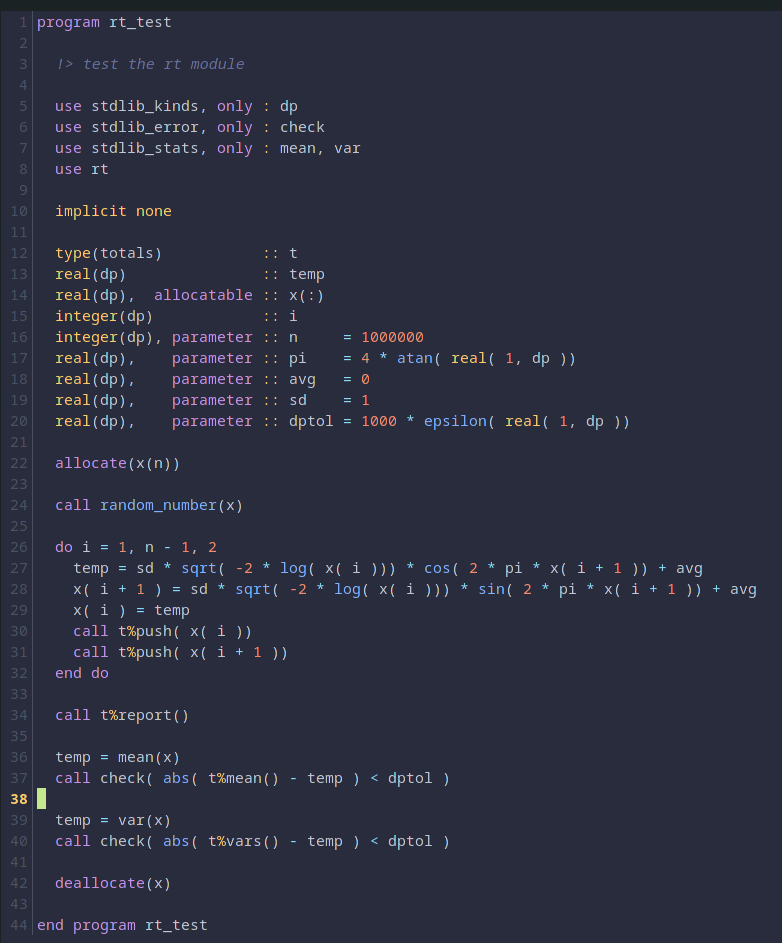

# f90.kak
modern fortran syntax for kakoune editor

just copy or link f90.kak to your autoload folder.

preferably use a colorscheme that distinguishes functions and keywords e.g. palenight.

this provides syntax for how i prefer to code fortran, so, for example, i would code this:

(x1␣-␣-3.1\*sin(x)) as (␣x1␣-␣-3.1␣\*␣sin(␣x␣)␣)

i.e spaces ( ␣ ) before parenthesis and spaces between operators ( + - / * ). Not following these rules will result in syntax not showing correctly, which forces you to follow IMO better coding practices.

2 spaces are used for indentation and gnu-fortran keywords and functions are included. both lower- and upper-case supported. this is strictly free-form format and I don't have plans right now to develop kak syntax for pre-f90 or fixed format files.

these defaults and behaviours, of course, can easily be changed by editing the .kak file
using kakoune's very flexible scripting. https://github.com/mawww/kakoune/tree/master/rc/filetype provides examples of syntax for other built-in languages.

i'll continue to update this file as i come across missing elements. PR's welcome.

an example showing the syntax using the palenight colorscheme is shown below:

